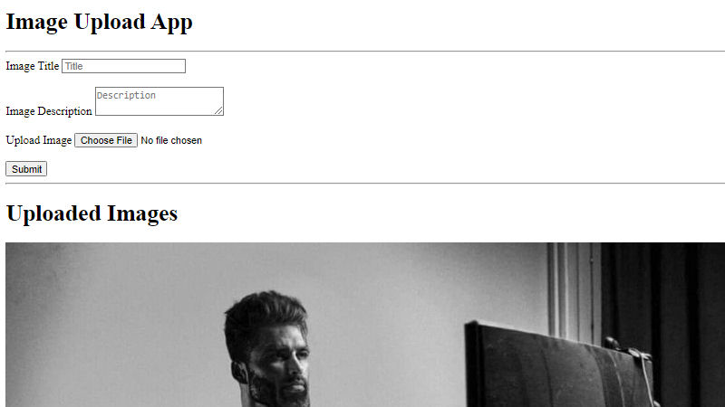

# Uploaded Image Gallery (WIP)
Upload your images to the gallery and share them with the world!

## How It's Made:

**Tech used:** HTML, CSS, JavaScript, Node.js, MongoDB, Mongoose

## How To Run It Locally:

1. Ensure that you have Git and Node.js installed.
2. Clone this repository (e.g., with `git clone https://github.com/warnshouse/image-upload-app.git`).
3. Move into the directory with `cd image-upload-app`.
4. Install the necessary dependencies with `npm install`.
5. Create a `.env` file setting the variable `DB_STRING` equal to your own database connection string.
6. Start the server with `npm start`.
7. Navigate to `localhost:3000` in your web browser and you're set!